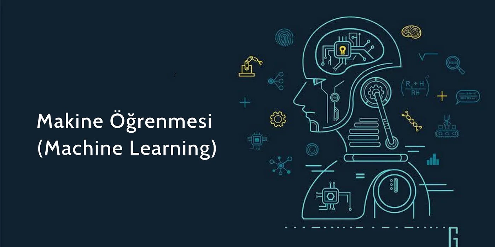

# Machine Learning Projects - Makine Öğrenmesi Projeleri

## Giriş
Bu depoda, makine öğrenimi alanında geliştirilmiş çeşitli projeler bulunmaktadır. Projeler, hem temel kavramları anlamak hem de farklı teknolojileri uygulamak için tasarlanmıştır. Her proje, kendi içinde öğrenme ve deneyim kazanma fırsatı sunmaktadır. 

## Task 1: Sayı Tahmin Oyunu - Flask Uygulaması


### Proje Özeti
Sayı Tahmin Oyunu, kullanıcıların rastgele bir sayı tahmin etmeye çalıştığı interaktif bir Flask uygulamasıdır. Oyun, kullanıcı etkileşimi ile eğlenceli ve öğretici bir deneyim sunar. Uygulama, kullanıcıların denemelerini takip eder ve doğru tahmin ettiklerinde oyun sıfırlanır.

### Teknolojiler
- Python
- Flask
- HTML
- CSS
- JavaScript
- Nginx
- Gunicorn

### Özellikler
- 0 ile 1000 arasında rastgele bir sayı oluşturulur.
- Kullanıcıya her tahmin sonrası geri bildirim verilir: "Daha yüksek" veya "Daha düşük" tahmin yapması gerektiği belirtilir.
- Kullanıcı doğru tahmini yaptığında, kaç denemede bulduğunu gösterir ve oyun sıfırlanarak yeniden başlar.
- Oturum yönetimi ile her kullanıcı için ayrı bir rastgele sayı ve deneme sayısı tutulur.

## Kurulum
1. Bu depoyu klonlayın:
   ```bash
   git clone https://github.com/FatihSir/Machine-Learning.git
   ```
2. Falza bilgi Task1 dosyasına girin

